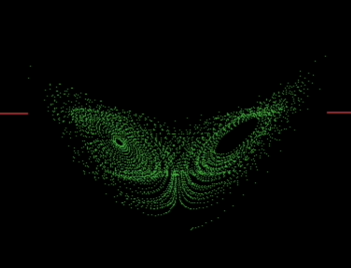

# Lorenz Attraktor on C64

https://github.com/user-attachments/assets/e2ddfaac-57ff-45fa-83a3-d15bf8e24276

## Compiling / Development

This project uses the [ACME][acme] assembler for no particular reason
but that it was the least complicated and most easy to find assembler.
I used ACME 0.97.

For testing I found it best to use [VICE][vice], I had a few problems
launching .PRG files with the default configuration so I created my
own launch script which enables auto start PRG mode.

Note: the script assumes that ROM files (KERNAL, BASIC, character set)
are present in the ROM/ directory. Make sure to place them there.
They can be found in the release [download][vice download] of VICE.

[acme]: https://github.com/meonwax/acme
[vice]: https://vice-emu.sourceforge.io/
[vice download]: https://vice-emu.sourceforge.io/index.html#download

## Running

    cd src
    make run

The screen should turn black and green dots should appear.

Note that normally you would need to start the program yourself using
a `SYS 2049` statement (or whatever the initial address is) to jump into
the code. We add a header value that adds a bit of BASIC code that does
this for us.

If you want to run a specific version of VICE, set the `X64SC` environment
variable.

## Running on C64

I used a SD2IEC adapter and copied the `src/myprg.prg` file to the root
of the SD card. Then it is just a matter of loading the program:

    LOAD "myprg.prg",8
    RUN

I had problems where the SD2IEC adapter didn't even load the directory list
(`LOAD "$",8`) and simply flashed the error LED. Do diagnose this I ran this
code:

    10 OPEN 15,8,15: INPUT #15,A$,B$,C$,D$
    20 CLOSE 15
    30 PRINT A$,B$,C$,D$
    RUN

The message I got was "74,Drive not ready,12,0" which was caused by a
intermittent fault of the SD card socket (card detect or write protect was not
triggered correctly). Re-inserting the SD card a few times solved the issue.

## Usage

There are three keys you can press:

- R for clearing the screen and resetting the X/Y/Z values
- N to play a melodic sound based on the current trajectory
- M to play a bass sound based on the current trajectory
- F for toggling [fast multiplication](#Fast-multiplication)

## Fast multiplication

`FMULT` from the BASIC kernal is not the fastest multiplication routine
there could be and by far the worst offender in terms of runtime, at least
according to [VICE profiling](https://vice-emu.sourceforge.io/vice_12.html#SEC336)
which shows that it takes around +55% of the total runtime just to do `FMULT`
and that is after we already used things like shifting the exponent directly
to multiply `dt`:

```
(C:$b9b2) prof graph depth 6
                                                           Total      %          Self      %
                                                   ------------- ------ ------------- ------
    [1] START                                         36.745.342 100,0%             0   0,0%
      [2] RST  -> fce2                                36.363.781  99,0%             0   0,0%
        [3] e39a -> e422                              36.363.781  99,0%             0   0,0%
          [4] a7e7 -> a7ed                            36.363.781  99,0%             0   0,0%
            [5] a7e7 -> a7ed                          36.363.781  99,0%        71.098   0,2%
              [8] 0c79 -> .xyz_step                   35.824.933  97,5%     1.275.328   3,5%
               [83] 0e52 -> .FMULT                     4.680.938  12,7%       291.002   0,8%
                [9] 0dbf -> .FMULT                     4.210.284  11,5%       299.894   0,8%
               [95] 0e34 -> .FMULT                     4.155.646  11,3%       295.502   0,8%
              [122] 0de4 -> .FMULT                     4.146.617  11,3%       294.084   0,8%
               [38] 0d68 -> .FMULT                     4.042.304  11,0%       293.582   0,8%
              [111] 0e05 -> .FACINX                      917.413   2,5%        33.696   0,1%
               [68] 0d14 -> .FACINX                      867.592   2,4%        33.678   0,1%
               [27] 0d89 -> .FACINX                      855.761   2,3%        33.678   0,1%
    [... skipped the rest of the context dump ...]
```

Ever since I stumbled upon [this writeup](https://probablydance.com/2025/02/08/why-does-integer-addition-approximate-float-multiplication/)
about multiplying floats by adding them I wanted to try this for CBM floats
and, after lots of simulation [in python](./src/mult_exp.py) I finally reached
an implementation that can draw the Lorentz attraktor. The python implementation
to simulate the CBM floats is not 100% accurate as it doesn't simulate the
presence of an always-set MSB in the mantissa for normalization (bit 31).
But since it is always-set in RAM to simulate the mantissa it *should* be
equivalent. At least the algorithm in assembler doesn't diverge much from
the python implementation.

Drawing `f(x) = 2/3 x + 0.5`:


The original implementation uses a certain bias to correct the mantissa,
on average, for the error. I decided to go with the naïve implementation
at a higher error (I think ~10%). If you want, you can implement that, of course.

Now the profile looks like this:

```
(C:$b9b2) prof graph depth 6
                                                   Total      %          Self      %
                                           ------------- ------ ------------- ------
    [1] START                                 51.054.907 100,0%             0   0,0%
      [2] RST  -> fce2                        50.524.736  99,0%             0   0,0%
        [3] e39a -> e422                      50.524.736  99,0%             0   0,0%
          [4] a7e7 -> a7ed                    50.524.736  99,0%             0   0,0%
            [5] a7e7 -> a7ed                  50.524.736  99,0%       211.356   0,4%
              [6] 0c79 -> .xyz_step           48.922.880  95,8%     3.734.688   7,3%
               [26] 0e05 -> .FACINX            2.916.418   5,7%       100.104   0,2%
               [21] 0e1d -> .FADD              2.559.430   5,0%       935.282   1,8%
               [12] 0e42 -> .FADD              2.391.310   4,7%       796.493   1,6%
                [8] 0e5c -> .QINT              1.626.714   3,2%       200.196   0,4%
               [31] 0df8 -> .FSUBT             1.612.184   3,2%     1.137.599   2,2%
               [10] 0e59 -> .fast_mult         1.126.188   2,2%       686.869   1,3%
               [16] 0e3b -> .fast_mult         1.124.436   2,2%       685.117   1,3%
               [18] 0e24 -> .MOVMF               617.207   1,2%       450.441   0,9%
    [... skipped the rest of the context dump ...]
```

`FMULT` - or rather `fast_mult` - is not even in the top 3 now. We effectively
removed the main bottleneck and are still drawing the equation rather nicely
considering the gain.

System with fast multiplication, errors are visible but OK:


What about the future? So what are the main offenders now?

```
(C:$0cc2) prof flat 10
        Total      %          Self      %
------------- ------ ------------- ------
    2.426.112  18,0%     2.426.112  18,0% b999
    1.511.033  11,2%     1.511.033  11,2% .CONUPK
    1.479.900  11,0%     1.479.900  11,0% b9b0
    3.005.589  22,2%     1.194.185   8,8% .FADD
    1.786.270  13,2%     1.088.937   8,1% .fast_mult
   12.947.888  95,8%       987.944   7,3% .xyz_step
    1.072.242   7,9%       702.461   5,2% .FSUB
      647.328   4,8%       647.328   4,8% .MOVFA
      617.890   4,6%       617.890   4,6% .MOVFM
      842.430   6,2%       585.855   4,3% .FSUBT
```

`$b999` is, according to [this helpful page](https://skoolkid.github.io/sk6502/c64rom/asm/B983.html#B999),
a subroutine for float to integer conversion. `.CONUPK` is used in the fast
mult for convenience to unpack the CBM float from RAM into FAC1. Both
could probably be optimized for the use case but I think the error is
already large enough as to not risk adding more.

## Resources

This project used several resources for which I am really grateful:

- [6502.org Instruction reference](http://www.6502.org/users/obelisk/6502/reference.html)
- [6502.org Addressing reference](http://www.6502.org/users/obelisk/6502/addressing.html)
- [6502.org Opcodes reference](http://www.6502.org/tutorials/6502opcodes.html)
- [c64-wiki BASIC floating point ops](https://www.c64-wiki.com/wiki/Floating_point_arithmetic)
- [c64-wiki Zeropage layout](https://www.c64-wiki.com/wiki/Zeropage)
- [codebase64 floating point ops](https://codebase64.org/doku.php?id=base:kernal_floating_point_mathematics)
- [codebase64 screen mode doc](https://www.codebase64.org/doku.php?id=base:built_in_screen_modes)
- [Christian Bauer's VIC-II screen doc](http://www.zimmers.net/cbmpics/cbm/c64/vic-ii.txt)
  (it seems to be the most correct one I found)
- [codebase64 micro tracker example](https://codebase64.org/doku.php?id=base:microtracker_v1.0)
- [cbm64 memory assignment map](https://sta.c64.org/cbm64mem.html)

There are three python scripts that were helpful in the development of
the final assembler code.

1. [`attraktor.py`](./attraktor.py) - a reference implementation that got
   subsequently optimized to bit oeprations
2. [`encode_xy.py`](./src/encode_xy.py) - a way of testing & reverse engineering
   the bit addressing in the 320x200 (but actually 40x25 byte) screen of the
   C64
3. [`cbm_to_float.py`](./src/cbm_to_float.py) - a script of converting C64
   floating point numbers (5 byte) to python floats for easy debugging with
   the VICE monitor
